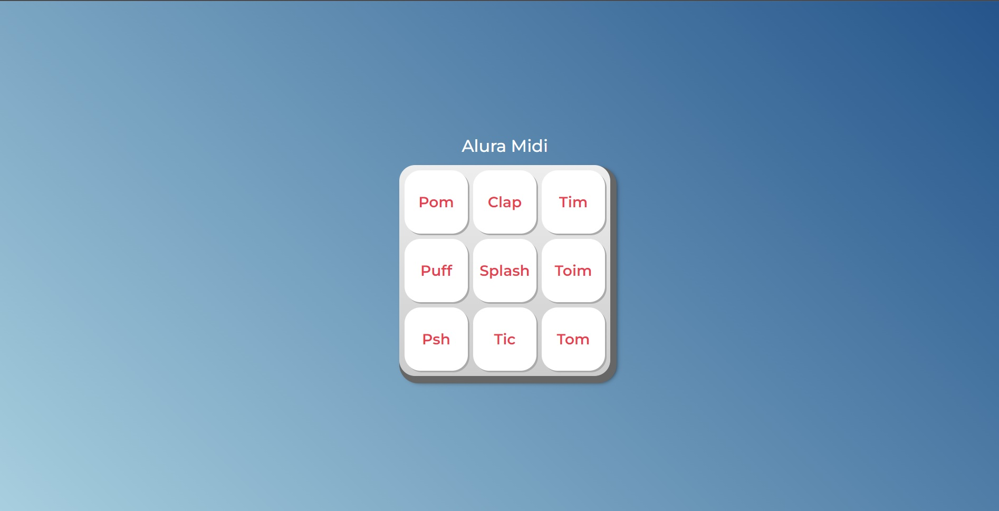

<h1 align="center">Alura Midi</h1>

Projeto realizado no curso, JavaScript para Web: Crie páginas dinâmicas, oferecido pela alura e Projeto Desenvolve 2022 do Grupo Boticário

<h1 align="center">
  
</h1>
 
 
 
### Tecnologias

As seguintes ferramentas foram usadas na construção do projeto:

- [HTML]
- [CSS]
- [Java Script]
 
 
 

### Desenvolvido

Made with 💜 by FERNANDO 👋

---